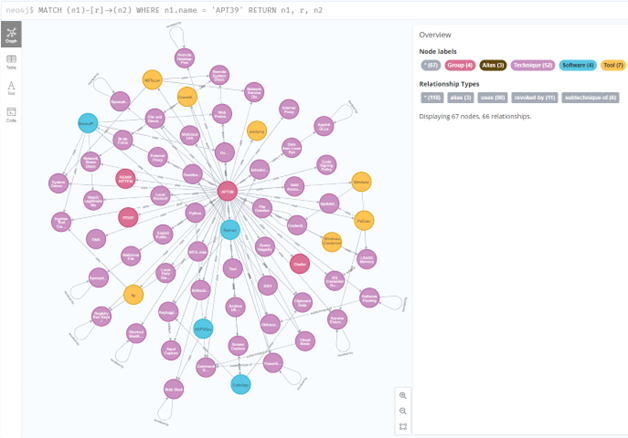

# Cyber Threat Intelligence Knowledge Base Aligned with MITRE ATT&CK® Framework

We built a CTI KB using MITRE ATT&CK® v12. The CTI KB encompasses an extensive array of cyber threat tactics, techniques, and procedures (TTPs), aimed at bolstering research and practical applications in cybersecurity. We extracted all the MITRE ATT&CK® techniques and generated a graph database hosted on [Neo4j graph database management system][neo]. We used the open-source JSON file from the [MITRE CTI][mitrecti] and parsed all nodes (attack-pattern, campaign, intrusion-set, tools, etc.) and their relationships into a graph database.

The CTI database contains up to 2060 nodes, 27411 relationships, and 366 APTs conducted using up to 861 unique techniques.

## Installation

### Requirements
* Python 3
* Neo4J Desktop (1.4.15)

### How-To
1. Create a new Neo4j database
2. Configure database
    + Install APOC Plugin

    + Modify the database configuration:
    
        Choose: `Your database -> ... (Three Dots) -> Settings`
        + Uncomment: 
        
          `dbms.directories.plugins=plugins`
        
        + Uncomment and modify:

          `dbms.security.procedures.unrestricted=apoc.*`

          `dbms.security.procedures.whitelist=apoc.*,apoc.coll.*,apoc.load.*`

    + Configure Database Settings File

        Choose: `Your database -> ... (Three Dots) -> Settings`

        Go to last line and set the commands below

        `apoc.export.file.enabled=true`

        `apoc.import.file.enabled=true`

        `apoc.import.file.user_neo4j_config=false`

        `cypher.lenient_create_relationship=true`
      
    + Configure Memory Usage

      `dbms.memory.heap.initial_size=4G`

      `dbms.memory.heap.max_size=8G`
      
      `dbms.memory.pagecache.size=4G`

3. Install the Python requirements

    `> pip install -r requirements.txt`

4. Download the MITRE Entreprise ATT&CK database in JSON format

    `wget https://github.com/mitre/cti/blob/master/enterprise-attack/enterprise-attack.json`


5. Configure the main.py script

    ```python
    100. # open graph connection`
    101. graph_bolt = "bolt://127.0.0.1:7687"
    102. graph_auth = ("neo4j","1234")
    ```

6. Run the script

    `> python main.py --debug -f mitre-enterprise-attack.json -g -s -o -t -r`

7. Example: Find involved nodes (techniques, software, tools) and their relations related to APT39.

    

## Citation
If you are interested in our work, please consider citing the following research paper:

```bibtex
@inproceedings{nour2023accurify,
  title     =  {{Accurify: Automated New Testflows Generation for Attack Variants in Threat Hunting}},
  author    =  {B. Nour and M. Pourzandi and R. K. Qureshi and M. Debbabi},
  booktitle =  {Foundations and Practice of Security (FPS)},
  month     =  {Dec},
  address   =  {Bordeaux, France},
  publisher = {Springer},
  doi       =  {10.1007/978-3-031-57540-2_5},
  year      =  {2023}
}
```

```bibtex
@article{nour2024automa,
  title     = {{Automa: Automated Generation of Attack Hypotheses and Their Variants for Threat Hunting using Knowledge Discovery}},
  author    = {B. Nour and M. Pourzandi and RK. Qureshi and M. Debbabi},
  journal   = {IEEE Transactions on Network and Service Management},
  doi       = {10.1109/TNSM.2024.3378972},
  year      = {2024},
  publisher = {IEEE}
}
```

## Licence
The MITRE Corporation (MITRE) hereby grants you a non-exclusive, royalty-free license to use ATT&CK® for research, development, and commercial purposes. Any copy you make for such purposes is authorized provided that you reproduce MITRE's copyright designation and this license in any such copy.

"© 2023 The MITRE Corporation. This work is reproduced and distributed with the permission of The MITRE Corporation."

DISCLAIMERS

MITRE does not claim ATT&CK enumerates all possibilities for the types of actions and behaviors documented as part of its adversary model and framework of techniques. Using the information contained within ATT&CK to address or cover full categories of techniques will not guarantee full defensive coverage as there may be undisclosed techniques or variations on existing techniques not documented by ATT&CK.

ALL DOCUMENTS AND THE INFORMATION CONTAINED THEREIN ARE PROVIDED ON AN "AS IS" BASIS AND THE CONTRIBUTOR, THE ORGANIZATION HE/SHE REPRESENTS OR IS SPONSORED BY (IF ANY), THE MITRE CORPORATION, ITS BOARD OF TRUSTEES, OFFICERS, AGENTS, AND EMPLOYEES, DISCLAIM ALL WARRANTIES, EXPRESS OR IMPLIED, INCLUDING BUT NOT LIMITED TO ANY WARRANTY THAT THE USE OF THE INFORMATION THEREIN WILL NOT INFRINGE ANY RIGHTS OR ANY IMPLIED WARRANTIES OF MERCHANTABILITY OR FITNESS FOR A PARTICULAR PURPOSE.

See [MITRE FAQ][faq] [1] and [MITRE License][licence] [2] for more information on how to use and represent the ATT&CK name.

[1] MITRE FAQ: https://attack.mitre.org/resources/faq/ 

[2] MITRE License: https://attack.mitre.org/resources/terms-of-use/

[faq]: https://attack.mitre.org/resources/faq/ "FAQ"
[licence]: https://attack.mitre.org/resources/terms-of-use/ "Licence"
[neo]: www.neo4j.com "Neo4j graph database management system"
[mitrecti]: www.github.com/mitre/cti/ "MITRE CTI"
